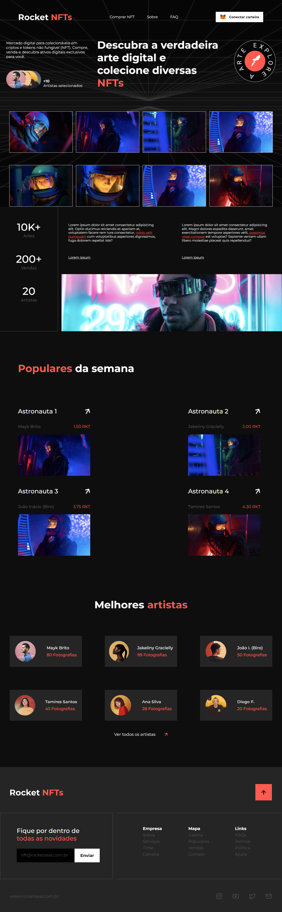

# Rocket NFTs
Projeto criado através da plataforma Rocketseat - Trilha Discover

## Deploy da aplicação
https://rocket-nfts-beta.vercel.app/

## Tecnologias utilizadas
+ HTML5
+ CSS3

## Estrutura do site
+ Barra de navegação
+ Seção de galerira de fotos de astronautas e artistas
+ Informações sobre a Rocket NFTs
+ Astronautas populares da semana
+ Melhores artistas
+ Rodapé

## Home 

